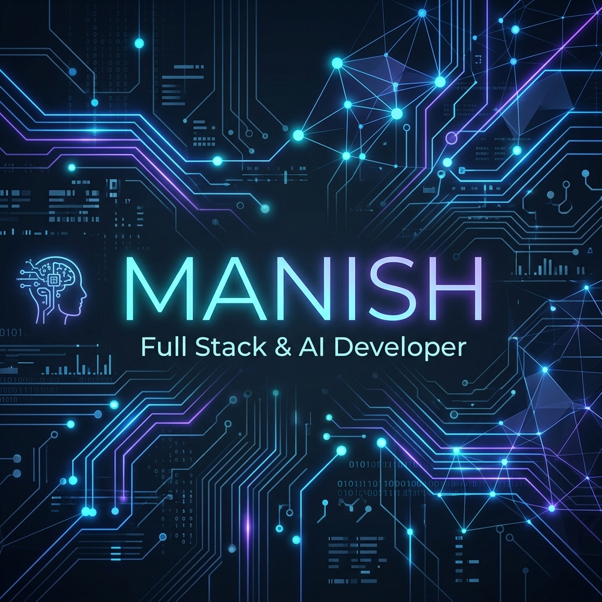

  

  
  
  

  

---

## 🚀 About Me

I am a passionate **Full Stack Developer** and **AI Engineer** specializing in building scalable web applications, Retrieval-Augmented Generation (RAG) pipelines, Large Language Models (LLMs), semantic search architectures, cloud deployment, and intelligent system automation. Experienced in engineering production-ready AI systems and enterprise software workflows.

- 🎓 **Education**: Computer Science Undergraduate
- 💼 **Experience**: Full Stack Developer & AI Intern
- 🤖 **AI Specialization**: RAG & GraphRAG, Vector Databases, Semantic Search, Neural Reranking
- 🌱 **Current Focus**: Multi-agent orchestration, LLM inference optimization, and 3D graphics
- 📧 **Contact**: yourmail@gmail.com

  

---

## 💻 Tech Stack

### Languages

  

### Frontend

  

### Backend & Databases

  

### Cloud & DevOps

  

### Tools

  

### AI, Machine Learning & Graphics

  <code>LangChain</code> &nbsp; <code>OpenAI API</code> &nbsp; <code>Gemini API</code> &nbsp; <code>Sentence Transformers</code> &nbsp; <code>TensorFlow</code> &nbsp; <code>OpenCV</code> &nbsp; <code>Pix2Pix GAN</code> &nbsp; <code>Three.js</code> &nbsp; <code>React Three Fiber</code> &nbsp; <code>Knowledge Graphs</code> &nbsp; <code>GraphRAG</code> &nbsp; <code>Semantic Search</code> &nbsp; <code>Embeddings</code> &nbsp; <code>LLMs</code>

---

## 🚀 Featured Projects

| Project | Description | Tech Stack | Documentation |
|:---|:---|:---|:---:|
| **AI – Industrial Knowledge Platform** | Enterprise GraphRAG platform combining structured knowledge graphs (Neo4j) with vector search for document query. | Python, Neo4j, Redis, LangChain, FastAPI, Docker | [README](./templates/AI-Knowledge-Platform-README.md) |
| **AI – Candidate Ranking System** | HR screening dashboard ranking 100,000+ profiles via semantic search, embeddings, and reranking models. | Python, FastAPI, Transformers, Gemini, TypeScript | [README](./templates/Candidate-Ranking-README.md) |
| **Invexis Restaurant Management** | Production-ready restaurant ERP with table-side QR orders, AI OCR invoice ingestion, and FIFO stock rules. | React, Node.js, Express, MongoDB, PG, Vision API | [README](./templates/Invexis-Restaurant-README.md) |
| **AI – Jewelry Design Generation** | Pix2Pix conditional GAN that translates designer sketch lines into realistic jewelry renders. | Python, TensorFlow, Pix2Pix GAN, OpenCV, MERN | [README](./templates/Jewelry-Generation-README.md) |
| **3D Virtual Tour Platform** | Immersive WebGL tour application rendering panoramic scenes and dynamic hotspots inside a 3D sphere. | React, Three.js, React Three Fiber, Node.js, Express | [README](./templates/Virtual-Tour-README.md) |

---

## 📈 GitHub Statistics

<table border="0" align="center" width="100%">
  <tr>
    <td align="center" width="50%">
      
    </td>
    <td align="center" width="50%">
      
    </td>
  </tr>
</table>

<table border="0" align="center" width="100%">
  <tr>
    <td align="center" width="100%">
      
    </td>
  </tr>
</table>

---

## 📊 Contribution Activity

  

---

## 🌐 Connect With Me

  
  &nbsp;&nbsp;&nbsp;&nbsp;
  
  &nbsp;&nbsp;&nbsp;&nbsp;
  
  &nbsp;&nbsp;&nbsp;&nbsp;
  

  ⭐ <i>Thanks for visiting my profile! Let's build something extraordinary together.</i> ⭐

