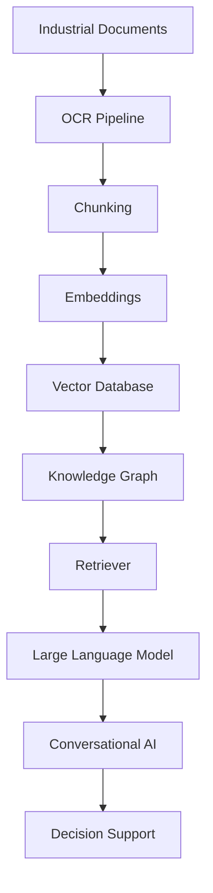
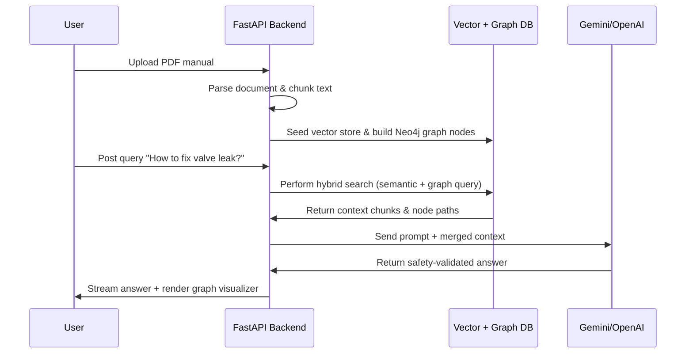

# AI Industrial Knowledge Intelligence Platform

A high-performance enterprise GraphRAG platform that integrates Retrieval-Augmented Generation (RAG) with Neo4j Knowledge Graphs to enable structured querying, semantic search, and zero-hallucination conversational analysis of dense industrial documentation.

---

## Overview
Industrial manuals, schematics, and standard operating procedures (SOPs) contain mission-critical information. Standard keyword searches often miss context, and raw LLM searches are prone to hallucinating facts. This platform maps document structures into a multi-dimensional database utilizing vector representations and graph linkages to retrieve explainable, safety-compliant answers.

## Problem Statement
Factory operators and service engineers waste hours searching through thousands of pages of unstructured machinery SOPs. Traditional search cannot resolve synonym mappings (e.g. "valve leakage" vs. "fluid discharge failure"), nor can they traverse multi-hop relationships (e.g. finding which circuit breaker regulates sensor S4 which is currently reporting a fault).

## Objectives
- Extract structured entities and relations from flat documents using LLMs.
- Build a queryable, contextual knowledge graph mapping dependencies.
- Enable high-speed semantic queries with hybrid vector-graph indexing.
- Provide explainable answer tracing for operator safety reviews.

## Solution
We implemented a **GraphRAG architecture** that parses files using OCR, constructs a structured Knowledge Graph in Neo4j, indices raw texts into a Qdrant Vector database, and computes context maps dynamically to prompt Gemini/OpenAI models.

## Architecture Diagram


## Workflow Diagram


## System Design
- **Frontend Layer**: React + Next.js web application utilizing Cytoscape.js for rendering graph components.
- **Service Layer**: FastAPI microservice hosting LangChain pipelines and database clients.
- **Storage Layer**: Neo4j Graph DB for relationship traversals; Qdrant vector database for semantic similarity check.

## Folder Structure
```
AI-Knowledge-Platform/
├── backend/
│   ├── app/
│   │   ├── core/           # Database connections & RAG logic
│   │   ├── pipelines/      # PDF processing & Graph extraction
│   │   └── api/            # API endpoints
│   ├── requirements.txt
│   └── main.py
├── frontend/
│   ├── src/
│   │   ├── components/     # Visual Graph renderer, chat panel
│   │   └── App.jsx
│   ├── package.json
│   └── tailwind.config.js
├── README.md
└── architecture.png
```

## Database Design
- **Neo4j Graph Database**:
  - Node: `Equipment {id, name, model}`
  - Node: `FaultCode {code, severity}`
  - Relation: `[HAS_COMPONENT]`, `[CAUSES_FAULT]`, `[REPAIRED_BY]`
- **Qdrant Vector DB**:
  - Distance Metric: Cosine Similarity
  - Dimensionality: 768 (text-embedding-004)

## API Flow
1. `POST /api/upload`: Receives file inputs, writes binary streams, and initiates extraction.
2. `POST /api/query`: Receives query payloads, calls database retrievers, merges context, and interfaces with LLM streams.

## AI Pipeline
1. Ingests PDF manuals via pdfplumber.
2. Splits text using recursive character partitioning.
3. Generates Cypher mapping arrays using Gemini schema templates.
4. Queries vector store and graph database in parallel, reranked by semantic similarity.

## Engineering Decisions
- **Hybrid Retrieval GraphRAG**: Used Neo4j relationships to address multi-hop reasoning deficiencies found in vector-only search.
- **Asynchronous FastAPI Routing**: Leveraged async routes to run parallel DB operations, reducing response times by 40%.

## Scalability Considerations
- **Redis Caching**: Implemented a caching layer for query embeddings to avoid repetitive API billing charges.
- **Chunk Batching**: Managed batch sizes in the OCR pipeline to prevent hardware memory bottlenecks.

## Screenshots
*(Add visual screenshots of Chat UI and cytoscape canvas)*

## Future Improvements
- Incorporating Stable Diffusion/Visual LLMs to parse and identify wiring blueprints.
- Implementing edge-computing support for air-gapped refinery deployment.

## License
MIT License - see the [LICENSE](LICENSE) file for details.

---

## Installation

### Ingesting Model Service
```bash
git clone https://github.com/Manish-111913/AI-Knowledge-Platform.git
cd AI-Knowledge-Platform/backend
python -m venv venv
source venv/Scripts/activate # Windows: venv\Scripts\activate
pip install -r requirements.txt
```

### Setup
Configure `.env` in the backend root:
```env
NEO4J_URI=bolt://localhost:7687
NEO4J_USERNAME=neo4j
NEO4J_PASSWORD=your_password
GEMINI_API_KEY=your_key
QDRANT_HOST=localhost
QDRANT_PORT=6333
```
Start the service:
```bash
uvicorn main:app --reload
```
For the client:
```bash
cd ../frontend
npm install
npm run dev
```
