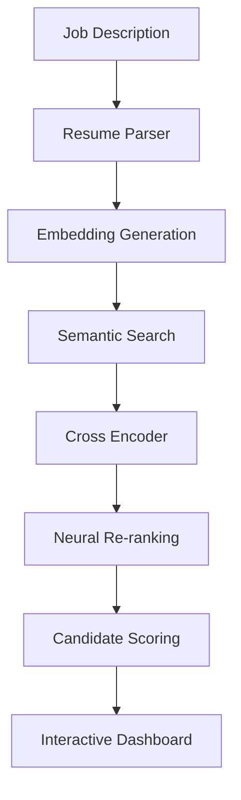
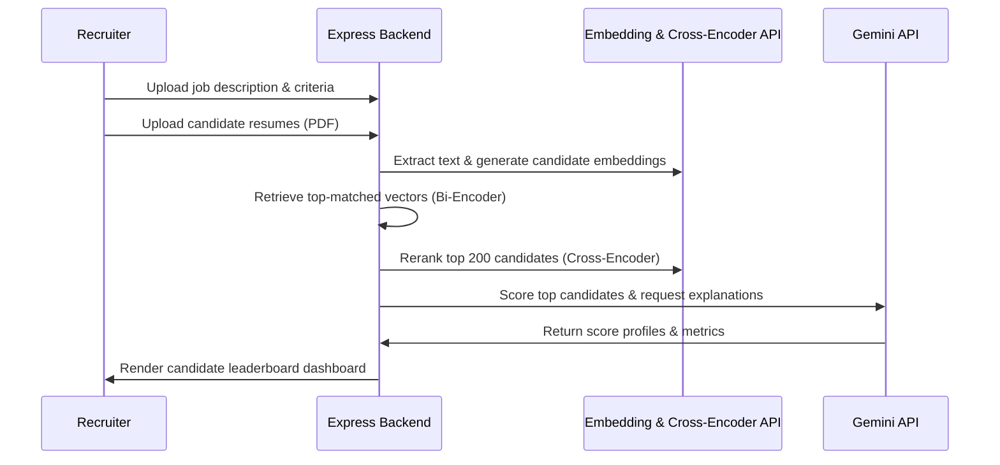

# AI – Intelligent Candidate Ranking System

An enterprise-grade applicant tracking and semantic resume scoring pipeline designed to index, search, and rank over 100,000+ candidate profiles with human-level accuracy using cross-encoders, vector space models, and Google Gemini LLMs.

---

## Overview
Traditional ATS platforms filter candidate profiles based on keyword matching, leading to high false-negative rates. This platform uses bi-encoder embeddings for high-speed candidate retrieval, cross-encoders for precise context re-ranking, and generative models to explain score breakdowns, eliminating bias and accelerating screening.

## Problem Statement
Recruitment teams receive thousands of resumes per job opening. Keyword filters fail to match conceptually similar terms (e.g., "fastapi" and "rest api design" or "ml engineer" and "data scientist"), while manual screening leads to high evaluation times and fatigue-induced bias.

## Objectives
- Perform multipage text extraction from PDF/Word resumes.
- Implement high-speed vector retrieval across 100,000+ profiles.
- Integrate neural cross-encoder models for context-aware candidate reranking.
- Explain scoring decisions visually to reduce recruiter assessment workload.

## Solution
We engineered a multi-stage semantic retrieval and scoring system using bi-encoder representations for first-stage pruning, transformer cross-encoders for second-stage reranking, and Gemini models to construct detailed explanations.

## Architecture Diagram


## Workflow Diagram


## System Design
- **Frontend Panel**: React interface hosting file upload widgets, visual radar scoring charts, and candidate grids.
- **Backend Service**: Node.js & Express API orchestration server.
- **AI Reranking Microservice**: Python flask service hosting Sentence Transformers and local cross-encoder models.
- **Data Store**: MongoDB database.

## Folder Structure
```
AI-Candidate-Ranking/
├── backend/
│   ├── src/
│   │   ├── config/         # MongoDB connections
│   │   ├── controllers/    # Pipeline steps
│   │   ├── models/         # Resume and job schemas
│   │   └── routes/         # Express routes
│   ├── package.json
│   └── server.js
├── frontend/
│   ├── src/
│   │   ├── components/     # Upload cards, leaderboard lists
│   │   └── App.jsx
│   └── package.json
└── README.md
```

## Database Design
- **MongoDB Schema**:
  - `Job`: `{ id, title, description, keywords: [] }`
  - `Resume`: `{ candidateId, extractedText, embeddedArray: [] }`
  - `MatchScores`: `{ jobId, candidateId, rawSemantic, crossEncoderScore, explanationCard: {} }`

## API Flow
1. `POST /api/jobs`: Registers a job criteria context profile.
2. `POST /api/resumes/upload`: Accepts files and schedules text parse queues.
3. `GET /api/jobs/:id/rankings`: Coordinates the retrieval-reranking task and returns the sorted lists.

## AI Pipeline
1. **Parser**: Text is parsed via pdf-parse.
2. **Dense Retrieval (Stage 1)**: Vector search narrows down profiles using `sentence-transformers/all-MiniLM-L6-v2`.
3. **Reranking (Stage 2)**: Re-scores top outputs using `cross-encoder/ms-marco-MiniLM-L-6-v2`.
4. **Scoring Explanation (Stage 3)**: LLM outlines positive/negative suitability variables.

## Engineering Decisions
- **Bi-Encoder + Cross-Encoder Architecture**: Combining these two methods ensures high-speed search across 100,000+ files while maintaining the accuracy of deep-learning cross-attention models.
- **Redis Message Queue**: Added to isolate LLM batch calls and manage throttling limits.

## Scalability Considerations
- **Concurrency Management**: Implemented batch parsing limits to prevent CPU exhaustion on server nodes during massive document uploads.

## Screenshots
*(Add visual screens of ATS candidate scores and radar charts)*

## Future Improvements
- Multi-language resume parsing support.
- Integration with third-party applicant portals.

## License
MIT License - see the [LICENSE](LICENSE) file for details.

---

## Installation

### Project Setup
```bash
git clone https://github.com/Manish-111913/AI-Candidate-Ranking.git
cd AI-Candidate-Ranking
```

### Setup
Create a `.env` file in the backend root:
```env
PORT=5000
MONGO_URI=mongodb://localhost:27017/candidate_ranking
GEMINI_API_KEY=your_key
```
Start the application server:
```bash
cd backend
npm install
npm run dev
```
Start the frontend development server:
```bash
cd ../frontend
npm install
npm run dev
```
