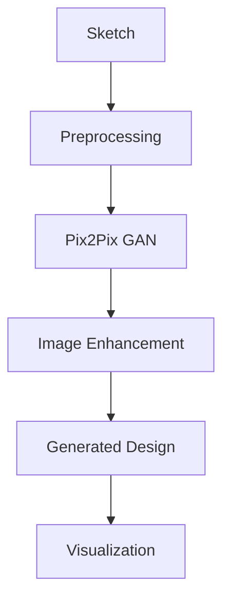
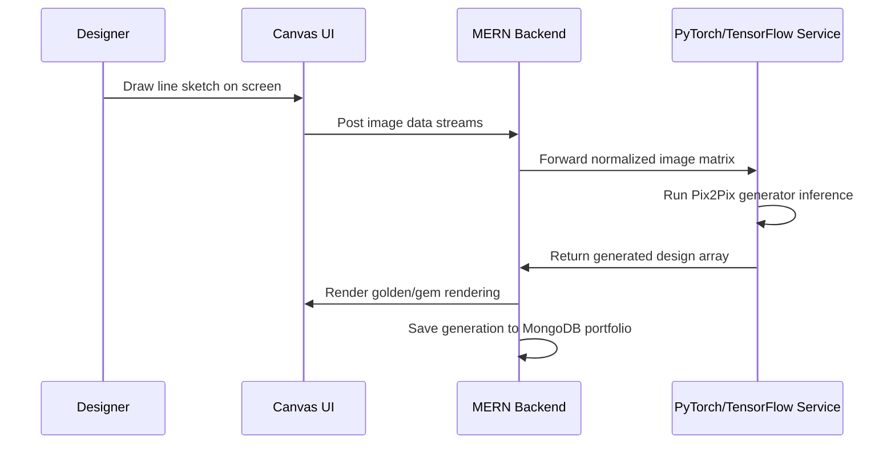

# AI-Powered Jewelry Design Generation System

A generative deep learning system that translates flat, hand-drawn line sketches into high-fidelity, realistic 3D jewelry product renders using a Conditional Generative Adversarial Network (cGAN) model integrated with a MERN stack application.

---

## Overview
Industrial design processes require rapid prototyping and visualization. Creating 3D renders from sketches is slow and requires specialized CAD designers. This project uses generative adversarial networks to automatically translate contours and lines into realistic material models (gold, silver, diamonds), cutting concept generation times.

## Problem Statement
Iterative concept sketches take hours of manual drawing. The traditional CAD modeling phase takes even longer, making client presentation feedback loops slow. Furthermore, generative diffusion models can be too computationally expensive for fast web interactions or lack the pixel-level spatial accuracy required to preserve a designer's exact stroke contours.

## Objectives
- Implement browser-based sketch drawing interface canvas.
- Preprocess hand-drawn drawings using OpenCV edge algorithms.
- Integrate Pix2Pix GAN model to translate line drawings into realistic renders.
- Minimize generation latency for real-time inference on consumer GPUs.

## Solution
We built an interactive, browser-integrated GAN framework utilizing a U-Net based Generator and PatchGAN Discriminator trained on jewelry sketch-to-image dataset pairs.

## Architecture Diagram


## Workflow Diagram


## System Design
- **Frontend Drawing Layer**: React Canvas API component with options for thickness and export profiles.
- **Backend API Layer**: Node.js & Express database pipeline routing.
- **Generative Model Server**: Python Flask service hosting TensorFlow GAN architecture.

## Folder Structure
```
AI-Jewelry-Generation/
├── model_service/
│   ├── weights/            # Trained GAN weights (.h5)
│   ├── model/              # Pix2Pix model structures
│   ├── app.py              # Flask server for model inference
│   └── requirements.txt
├── server/
│   ├── src/
│   │   ├── config/         # MongoDB DB setups
│   │   ├── controllers/    # Portfolio routing
│   │   └── server.js
├── client/
│   ├── src/
│   │   ├── components/     # HTML5 Canvas component
│   │   └── App.jsx
│   └── package.json
└── README.md
```

## Database Design
- **MongoDB Schema**:
  - `DesignCatalog`: `{ userId, title, sketchUrl, outputRenderUrl, materialOptions: {}, createdAt }`

## API Flow
1. `POST /api/inference/generate`: Accepts base64 canvas drawings, routes data to python service, and returns processed product renders.
2. `POST /api/gallery`: Saves generation arrays and client identifiers to MongoDB workspace collections.

## AI Pipeline
- **cGAN Translator**:
  - Generator: U-Net encoder-decoder architecture mapping inputs down to latent space.
  - Discriminator: Overlap PatchGAN analyzing $70 \times 70$ pixel regions to determine reality scoring.
  - Loss Structure: Binary Cross Entropy Loss combined with L1 reconstruction loss function to preserve canvas boundaries.

## Engineering Decisions
- **Conditional GAN over Diffusion**: Chose Pix2Pix to maintain direct pixel-level spatial mappings. This guarantees the final product rendering perfectly follows the user's sketch line boundaries.
- **Asymmetric Microservices Setup**: Segmented python inference systems from web databases to scale heavy GPU workloads.

## Scalability Considerations
- **Tensor Queueing**: Implemented model pooling to prevent concurrent request blockages from locking GPU memory.

## Screenshots
*(Add visual screens of drawing canvas and GAN sketch-to-image outputs)*

## Future Improvements
- Texture variations using diffusion prompts.
- Export outputs into OBJ/STL files for direct 3D printing.

## License
MIT License - see the [LICENSE](LICENSE) file for details.

---

## Installation

### Clone & Local Setup
```bash
git clone https://github.com/Manish-111913/AI-Jewelry-Generation.git
cd AI-Jewelry-Generation
```

### Setup
Run the Flask model server:
```bash
cd model_service
python -m venv venv
source venv/Scripts/activate # Windows: venv\Scripts\activate
pip install -r requirements.txt
python app.py
```
Start MERN API services:
```bash
cd ../server
npm install
npm run start
```
Start React frontend drawer:
```bash
cd ../client
npm install
npm run start
```
