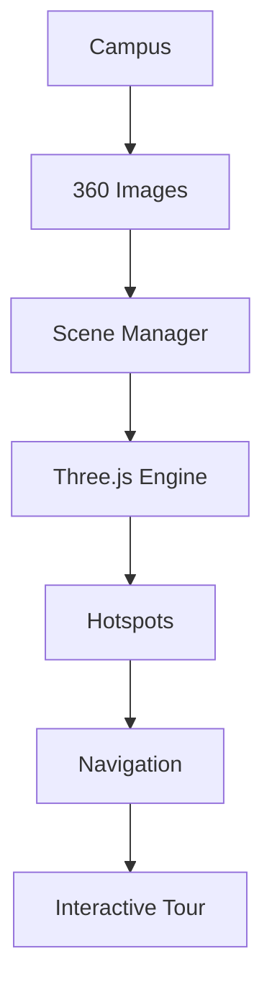
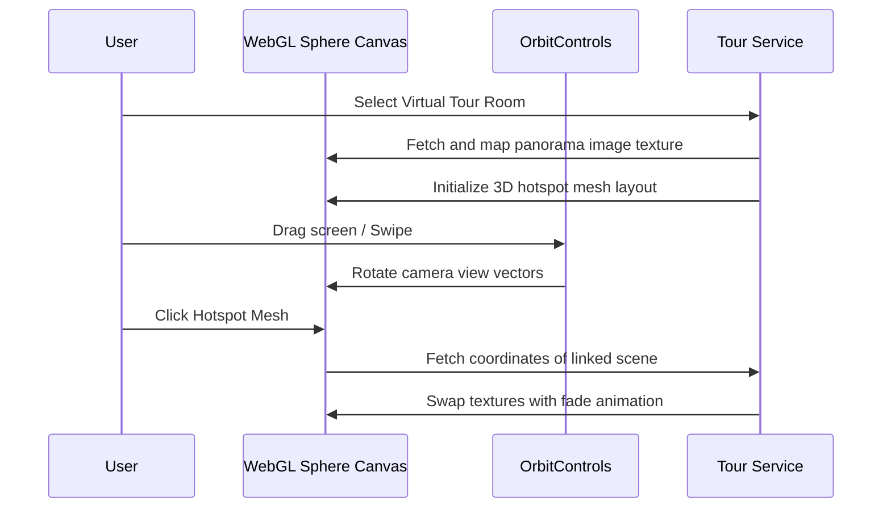

# 3D Virtual Tour Platform

An optimized, immersive WebGL-based virtual tour framework that renders high-resolution panoramic scenes and navigation mesh transitions inside a 3D browser canvas using Three.js and React Three Fiber.

---

## Overview
Traditional virtual tour frameworks are often monolithic, lag on mobile devices, or require proprietary browser players. This platform is a light, React-integrated open-source WebGL application that maps 360° panoramas onto coordinate spheres, supporting hotspots, maps, and progressive texture loading.

## Problem Statement
Displaying high-resolution panoramic images (often 8K or higher) causes significant rendering and memory overhead on mobile browsers, leading to lag, tab crashes, or slow page loads. Additionally, building connected navigation links between rooms (hotspots) requires complex manual coordinate calculations.

## Objectives
- Sphere project 360° panoramas smoothly using WebGL canvas objects.
- Implement camera controls with look dampening to minimize user latency issues.
- Support spatial hotspots that trigger scene jumps on click.
- Design an admin editor tool to visually map hotspot coords onto 3D spheres.

## Solution
We built an interactive, browser-based 3D scene engine using Three.js and OrbitControls to map equirectangular images inside a sphere geometry, supporting progressive image texture loading.

## Architecture Diagram


## Workflow Diagram


## System Design
- **View Layer**: React Canvas rendering using `@react-three/fiber` and `@react-three/drei`.
- **API Router**: Express server verifying user session states.
- **Storage Layer**: MongoDB stores metadata catalogs linking scene IDs to coordinate meshes.

## Folder Structure
```
Virtual-Tour-3D/
├── backend/
│   ├── src/
│   │   ├── config/         # Database configs
│   │   ├── controllers/    # Scene & hotspot logic
│   │   ├── models/         # Tour models
│   │   └── routes/         # API routes
│   └── server.js
├── client/
│   ├── src/
│   │   ├── components/     # ThreeCanvas, HotspotMesh
│   │   ├── pages/          # TourViewer, AdminTourBuilder
│   │   └── App.jsx
│   └── package.json
└── README.md
```

## Database Design
- **MongoDB Schema**:
  - `Scene`: `{ tourId, title, panoramaUrl, hotspots: [ { label, x, y, z, targetSceneId } ] }`

## API Flow
1. `GET /api/scenes/:id`: Queries the panorama image asset location and connected hotspots configuration.
2. `POST /api/scenes/:id/hotspots`: Submits calculated 3D coordinates $(x, y, z)$ to append navigation nodes.

## AI Pipeline
*(Not applicable for this graphical rendering project)*

## Engineering Decisions
- **R3F Integration**: Selected React Three Fiber to maintain the WebGL context as reactive component structures, preventing object leakage.
- **LOD Optimization**: Developed progressive texture loading loops to load low-res placeholders before fetching heavy assets.

## Scalability Considerations
- **AWS S3 Cloud Delivery**: Panoramas are served via optimized global CDN caches to minimize latency.

## Screenshots
*(Add visual screens of WebGL viewer and admin hotspot placement dashboard)*

## Future Improvements
- Spatial sound mapping using Web Audio APIs.
- VR Headset controller support using WebXR configurations.

## License
MIT License - see the [LICENSE](LICENSE) file for details.

---

## Installation

### Project Setup
```bash
git clone https://github.com/Manish-111913/Virtual-Tour-3D.git
cd Virtual-Tour-3D
```

### Setup
Run the Express backend database connection:
```bash
cd backend
npm install
npm run dev
```
Start the React WebGL application wrapper:
```bash
cd ../client
npm install
npm run dev
```
Configure `.env` in backend root before running:
```env
PORT=5000
MONGO_URI=mongodb://localhost:27017/virtual_tours
AWS_ACCESS_KEY_ID=your_key
AWS_SECRET_ACCESS_KEY=your_secret
AWS_BUCKET_NAME=your_bucket
```
